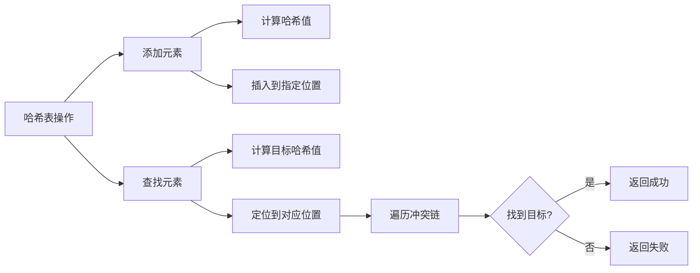

哈希表是根据**关键码的值**而直接进行访问的数据结构
直白来讲其实数组就是一张哈希表：哈希表中关键码就是数组的索引下标，然后通过下标直接访问数组中的元素

哈希表能解决什么问题呢，**一般哈希表都是用来快速判断一个元素是否出现集合里。**
例如要查询一个名字是否在这所学校里。
要枚举的话时间复杂度是O(n)，但如果使用哈希表的话， 只需要O(1)就可以做到。
我们只需要初始化把这所学校里学生的名字都存在哈希表里，在查询的时候通过索引直接就可以知道这位同学在不在这所学校里了。

# 用C语言演示哈希表原理
先介绍一下字符串中的常用函数及其头文件：
<string.h>头文件包含对字符串的操作的函数，在哈希表中常用的有：
- `strcpy(dest, src)` - string copy，把src的值复制到dest中
- `strcmp(a, b)` - string compare，对比二者，相同的话**输出是0**

以下是一个Mermaid流程图，概述哈希表的基本结构

对于初学者来说，重点是理解哈希表的核心思想，而不是完全掌握实现细节。下面的代码展示了底层原理，实际开发中可以直接使用现成的哈希表实现（如各种编程语言提供的内置字典、映射等）。关键要理解：
- 哈希函数如何将键映射到索引
- 冲突处理机制
- 时间复杂度优势

```c
#include <stdio.h>
#include <string.h>
#include <stdlib.h>

#define TABLE_SIZE 100  // 哈希表的总容量，就像有100个抽屉

// 定义哈希表节点结构体 - 就像一个装学生姓名的小盒子
typedef struct HashNode {
    char name[50];             // 存储学生姓名的空间
    struct HashNode* next;     // 如果多个学生名映射到同一个位置，就用链表连接起来，下面会讲
} HashNode;

// 全局哈希表 - 就像一个有100个抽屉的大柜子
HashNode* hash_table[TABLE_SIZE] = {NULL};  // 初始化为NULL，表示所有抽屉都是空的

// 哈希函数 - 就像一个神奇的计算器，输入姓名，输出应该存到哪个抽屉编号
unsigned int hash(const char* str) {
    unsigned int hash_value = 0;  // 初始哈希值
    
    // 对字符串中的每个字符进行计算
    while (*str) {                // 当字符串还有字符时循环
        hash_value = hash_value * 31 + *str;  // 这是计算哈希值的一种方法，*31是为了减少冲突
        str++;                    // 移动到下一个字符
    }
    
    // 将大数字压缩到抽屉范围之内（比如结果是157，但我们只有100个抽屉）
    // 所以用取余运算符 % 来确保结果在0-99之间
    return hash_value % TABLE_SIZE;  
}

// 往哈希表中添加学生姓名
void add_student(const char* name) {
    // 步骤1：先用哈希函数算出这个姓名应该放在哪个抽屉
    unsigned int index = hash(name);  // 返回0-99之间的抽屉编号
    
    // 步骤2：创建一个新的小盒子来装这个姓名
    HashNode* new_node = malloc(sizeof(HashNode));  // 在内存中申请空间
    strcpy(new_node->name, name);                   // 把姓名复制到盒子里
    new_node->next = hash_table[index];             // 把盒子连接到现有链表的开头
    hash_table[index] = new_node;                   // 更新抽屉指向新的盒子
}

// 在哈希表中查找学生
int find_student_hash(const char* name) {
    // 步骤1：用同样的哈希函数算出应该去哪个抽屉找
    unsigned int index = hash(name);  // 计算这个姓名对应的抽屉号
    
    // 步骤2：去那个抽屉里找
    HashNode* current = hash_table[index];  // 获取抽屉里的第一个盒子
    
    // 步骤3：如果抽屉里有东西（不是NULL），就开始逐个比较
    while (current != NULL) {          // 只要还有盒子可以查看
        if (strcmp(current->name, name) == 0) {  // 比较当前盒子的学生名和目标名字
            return 1;  // 找到了！返回1表示成功
        }
        current = current->next;         // 检查链表的下一个盒子
    }
    
    return 0;  // 遍历完了都没找到，返回0表示失败
}

int main() {
    // 使用示例：
    // 先把学校里的所有学生名添加到哈希表中
    add_student("张三");
    add_student("李四");  
    add_student("王五");
    
    // 然后就可以快速查找了
    if (find_student_hash("李四")) {      // 这行代码就是关键！
        printf("通过哈希表找到了李四\n");  // O(1)时间就能找到，非常快！
    } else {
        printf("通过哈希表没找到李四\n");
    }
    
    // 清理内存，释放之前申请的空间
    for (int i = 0; i < TABLE_SIZE; i++) {
        HashNode* current = hash_table[i];
        while (current != NULL) {
            HashNode* temp = current;      // 保存当前节点
            current = current->next;       // 移动到下一个
            free(temp);                    // 释放当前节点的内存
        }
    }
    
    return 0;
}
```

**核心原理解释：**
想象有一个巨大的抽屉柜，有100个抽屉（TABLE_SIZE=100）：

1. **哈希函数**就像一个秘书，你告诉他"张三"这个名字，他就能告诉你"张三"应该放在第7号抽屉里
2. **添加姓名**：先算出应该放哪个抽屉，然后把姓名放进去
3. **查找姓名**：同样用秘书帮忙算出应该去哪个抽屉，然后直接打开抽屉看有没有就行了
这样就不需要在整个学校里一个个找学生了，直接找到对应的抽屉即可，所以时间复杂度是O(1)！

**关于冲突处理：** 如果不同的名字被分配到同一个抽屉，就用链表把它们连起来，然后遍历一个链表查询。
将学生姓名映射到哈希表上就涉及到了**hash function ，也就是哈希函数**。
# 哈希函数
哈希函数，把学生的姓名直接映射为哈希表上的索引，然后就可以通过查询索引下标快速知道这位同学是否在这所学校里了。
如下图所示，通过hashCode把名字转化为数值，一般hashcode是通过特定编码方式，可以将其他数据格式转化为不同的数值，这样就把学生名字映射为哈希表上的索引数字了。

如果hashCode得到的数值大于 哈希表的大小了，也就是大于tableSize了，怎么办呢？
此时为了保证映射出来的索引数值都落在哈希表上，我们会在再次对数值做一个取模的操作，这样我们就保证了学生姓名一定可以映射到哈希表上了。

此时问题又来了，哈希表我们刚刚说过，就是一个数组。
如果学生的数量大于哈希表的大小怎么办，此时就算哈希函数计算的再均匀，也避免不了会有几位学生的名字同时映射到哈希表 同一个索引下标的位置。
接下来**哈希碰撞**登场
# 哈希碰撞
小李和小王都映射到了索引下标 1 的位置，**这一现象叫做哈希碰撞**。如图：

一般哈希碰撞有两种解决方法， 拉链法和线性探测法。

## 拉链法
发生冲突的元素都被存储在链表中。 这样我们就可以通过索引找到小李和小王了

（数据规模是dataSize， 哈希表的大小为tableSize）
拉链法就是要选择适当的哈希表的大小，这样既不会因为数组空值而浪费大量内存，也不会因为链表太长而在查找上浪费太多时间。
## 线性探测法
线性探测法属于**开放寻址法**：数组的每个位置只放**一个**元素（不像拉链法一个位置能挂一串链表），冲突了就去**找下一个空位**。

举个例子（假设 tableSize=5，张三、李四、王五都算出下标 1）：

| 操作 | 位置1 | 位置2 | 位置3 |
|------|-------|-------|-------|
| 插入张三 | 张三 | | |
| 插入李四（撞位置1） | 张三 | 李四 | |
| 插入王五（撞位置1、2） | 张三 | 李四 | 王五 |

查找走同一条路线：算到下标 1，发现不是目标，就**继续往后逐个找**；一旦**遇到空位**还没找到，就说明该元素不存在——因为插入时它一定会被放在第一个空位之前，不可能藏在空位后面。

使用线性探测法，一定要保证tableSize大于dataSize。 我们需要依靠哈希表中的空位来解决碰撞问题。
例如冲突的位置，放了小李，那么就向下找一个空位放置小王的信息。所以要求tableSize一定要大于dataSize ，要不然哈希表上就没有空置的位置来存放 冲突的数据了。如图：


两个顺带了解的缺点：
- **堆积问题**：冲突的元素连续向后填充，会形成一段"连号"区域，后续新元素要探测更远才能放下，查找变慢
- **删除麻烦**：删除不能直接置空，否则会截断查找链（后面的元素会因遇到空位而被误判为不存在），通常用"标记删除"
# 总结
总结一下，**当我们遇到了要快速判断一个元素是否出现集合里的时候，就要考虑哈希法**。
但是哈希法也是**牺牲了空间换取了时间**，因为我们要使用**额外的数组，set或者是map来存放数据**，才能实现快速的查找。
如果在做面试题目的时候遇到需要判断一个元素是否出现过的场景也应该第一时间想到哈希法。

> **重要提示：** 若使用C语言实现，相较于Python、Java等高级语言有先天的劣势，因为像Set、Map这样的高级数据结构都需要自己实现。所以在学习初期，建议优先掌握如何用数组来解决哈希表相关问题，这样更符合C语言的学习曲线。至于两数之和、三数之和、四数之和这种题目，还是用双指针更方便。

> 从解题角度：需要掌握 vs 不需要掌握
> **需要掌握：**
> - 哈希表核心能力：O(1) 判断某元素是否出现过，代价是**空间换时间**
> - 三种容器的选择：**数组**（数据范围小且连续，如 26 个字母）、**set**（只判存在/去重）、**dict/map**（键值映射，如 值→下标、值→次数）
> - 什么时候想到哈希法：需要快速判断某元素是否出现在集合里
>
> **不需要掌握（刷题阶段）：**
> - 手写哈希函数（* 31、取模等）：只需知道它负责把键映射成索引、取模压缩范围即可
> - 手写哈希表：C 直接使用 uthash，Python 用内置 dict/set
> - 拉链法/线性探测法：知道是解决冲突的两种思路、概念能说清楚即可，不需要会实现
