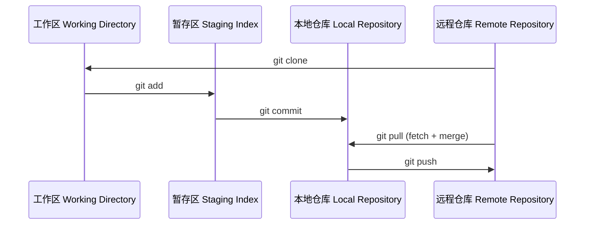

> Git 是一个版本控制工具。
> 现在 GitHub MCP/Agent 已经支持 PowerShell，无需再死记命令，只需用自然语言告诉 Agent 你想做什么即可。
> 安装： https://git-scm.com/install/ 
---
# 初始化
首先，进入你需要的目录
```bash
cd ~/Desktop
```
添加你的用户名和邮箱：
```bash
git config --global user.name "username"
git config --global user.email "email"
```
初始化：
```bash
git init
```
运行后，文件夹里会生成一个隐藏的 `.git` 目录。

如果想使用已有的仓库，可以把它克隆到本地：
```bash
git clone <address>
```
---
# 添加/提交/推送/拉取（Add/Commit/Push/Pull）
你可以在目录里新建一个 `.py` 文件，然后运行这条命令：
```bash
git status
```
这条命令会显示目录的当前状态，并提示新文件处于未暂存（unstaged）状态（所谓 unstaged，指的是这个文件还没有被纳入版本控制）。因此，它能告诉你哪些文件被修改了、哪些文件还没有被添加。

```bash
git add .
# git 文件名
```
运行 `git add .` 之后，新文件就会被加入暂存区，你可以再次查看状态进行确认。`git add` 后面的点表示这条命令会把所有改动都加入暂存区。

文件添加好以后，就可以用一句简短的说明信息来提交这次改动：
```bash
git commit -m "add a .py file"
```

以上步骤只是把改动保存在了本地。要想上传到远程服务器（比如 GitHub），需要运行：
```bash
git push 
# 第一次推送时：
# git remote add origin https://github.com/用户名/仓库名.git 先建立并连接仓库
# 连上之后和main分支对接 git push -u origin main
```

`.gitignore` 用于告诉 Git 忽略哪些文件/文件夹，避免 `.env`、`node_modules` 这类文件被纳入跟踪。

如果你和其他协作者都做了修改，而且对方已经抢先推送到了远程仓库，那么你需要先运行这条命令来同步本地版本：
```bash
git pull
# 先 pull，之后才能 push。
```


---
# 差异对比
每次提交都有一个唯一的 commit 哈希值，所以你可以把两个（或更多）提交 ID 提供给 AI 智能体，让它帮你展示两者之间的差异。对应的命令是：
```bash
git diff <commit A> <commit B>
```
---
# 重置/还原/检出（Reset/Revert/Checkout）
首先要知道，创建分支并不是复制一份代码，它只是新建了一个指向当前提交的指针。这意味着新分支上的所有提交都与主分支相互隔离。

有时你需要撤销某次提交，可以使用下面的命令：
1. **`git reset --hard <Commit ID>`：硬重置（Hard Reset）**
> 强制把仓库回退到某个指定的历史状态，该节点之后的所有提交都会被永久删除。  
> ⚠️ **警告：** 千万不要在共享/协作分支上使用这个命令，只能用在自己的本地私有分支上。
2. **`git revert <Commit ID>`：还原（Revert）**
> 创建一个新的“反向提交”，用来撤销之前某次提交的改动。这种方式安全，强烈推荐在协作分支上使用。它不会改变历史，只是让 Git 追加一条撤销记录。
3. **`git checkout <Commit ID>`：分离头指针（Detached HEAD）**
> 让仓库切换到某个特定的历史提交，仅供查看。在这种状态下不要做任何修改，因为改动很容易丢失。
---
# 分支/合并（Branches/Merge）
1. `git branch <branch_name>`：创建分支
> 创建一条独立的开发线（也就是一个新指针）。默认情况下，新分支基于当前分支创建（通常是 main 或 master）。
2. `git switch <branch_name>` / `git checkout <branch_name>`：切换分支
> 在不同的开发线之间切换。（`git switch` 是更新的、推荐的命令。）
3. `git merge <branch_name>`：合并
> 把指定分支上的改动合并进当前分支。
4. `git branch -d <branch_name>`：删除分支
> 清理已经合并过、不再需要的分支。（注意：不能删除你当前所在的分支，所以要先用 `git switch` 切换到其他分支。）
---
# 其他命令
```PowerShell
# 查看最近的提交日志
git log --oneline

# 确认远程连接是否正常。
git remote -v
# origin  https://github.com/.../projectname.git (fetch)
# origin  https://github.com/.../projectname.git (push)
```
